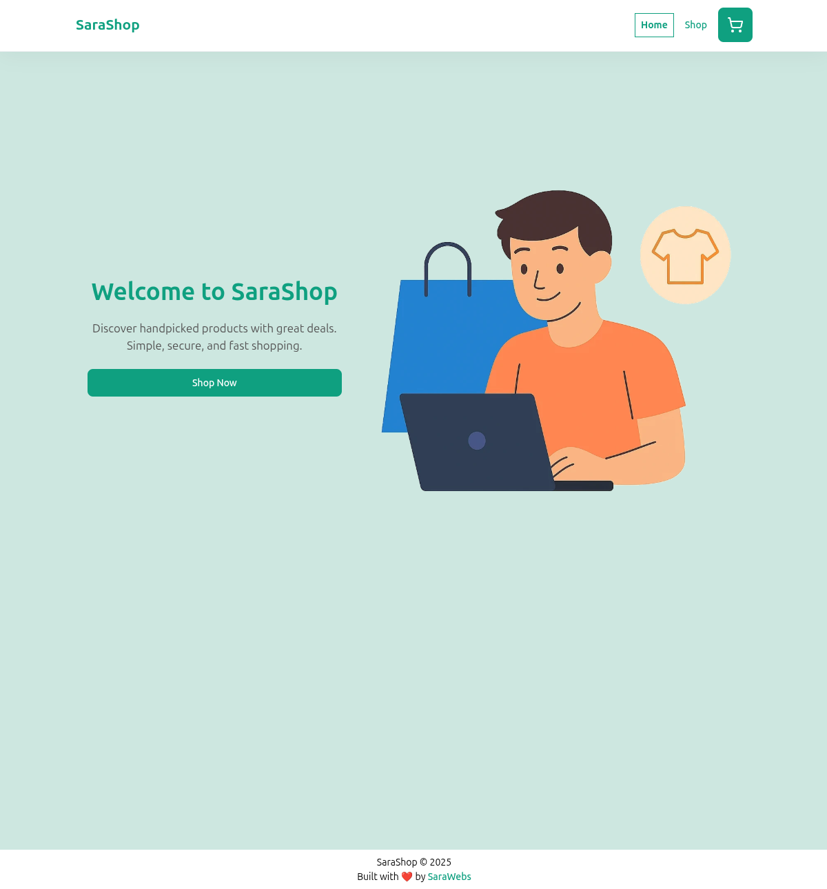
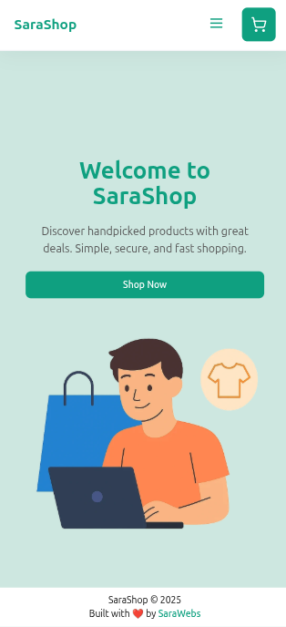

## 🛍️ SaraShop

**SaraShop** is a modern, fast, and responsive eCommerce web application built with **React** and **React Router**. It features a smooth shopping experience, dynamic product pages, cart management, and elegant UI components.

SaraShop Project, [TOP project](https://www.theodinproject.com/lessons/node-path-react-new-shopping-cart)
### ✨ Features

* 🛒 **Shopping Cart** with context-based global state
* 🔄 **Product Loader** via `react-router-dom` data APIs
* ⭐ **Rating System** using stars and reviews
* 📦 **Add to Cart** with success feedback and checkout link
* 🧠 **Reusable Components** like `GridItem`, `Hero`, and more
* 📱 **Responsive Design** for all screen sizes
* ⚛️ Built using **React 18** and modern hooks (e.g., `useState`, `useEffect`, `useContext`)
* ✅ **Tested with Vitest** and `@testing-library/react`

### 🧩 Tech Stack

* **Frontend:** React, React Router
* **State Management:** Context API
* **Styling:** CSS (flat, clean UI)
* **Testing:** Vitest, React Testing Library
* **Bundler:** Vite

### 🚀 Getting Started

```bash
git clone https://github.com/your-username/sarashop.git
cd sarashop
npm install
npm run dev
```

### 🧪 Run Tests

```bash
npm run test
```

[Code at GitHub](https://github.com/mdahamshi/top-shop)

[Live DEMO](https://link.dahamshi.xyz/top-shop)




